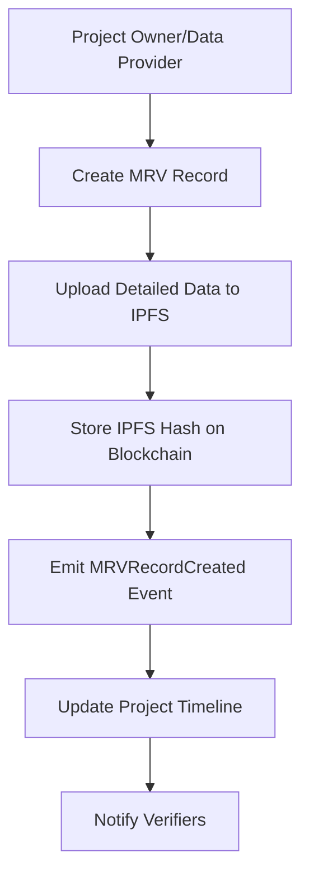
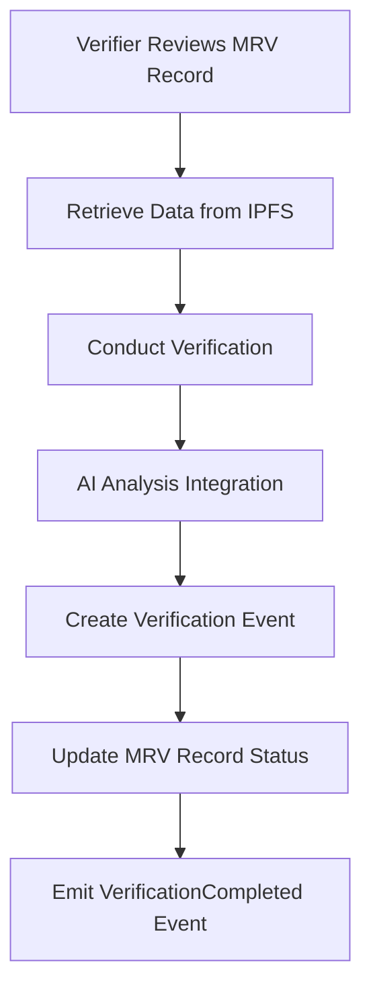
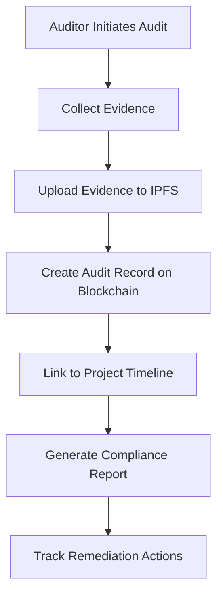

# 🛡️ CLORIT Blockchain-Based Audit Data & MRV Storage Implementation Guide

## 📋 **Executive Summary**

This document outlines a comprehensive strategy for storing audit data and MRV (Monitoring, Reporting, and Verification) information on the blockchain for your CLORIT platform. The solution provides immutable, transparent, and auditable records while maintaining compliance with international carbon credit standards.

---

## 🏗️ **Architecture Overview**

### **1. Multi-Layer Storage Strategy**

```
┌─────────────────────┐
│   Application Layer │  ← User interfaces, dashboards, analytics
├─────────────────────┤
│   Service Layer     │  ← MRV Registry Service, IPFS integration
├─────────────────────┤
│   Blockchain Layer  │  ← Smart contracts for immutable records
├─────────────────────┤
│   Storage Layer     │  ← IPFS for large data, PostgreSQL for queries
└─────────────────────┘
```

### **2. Data Classification**

| Data Type | Storage Location | Reason |
|-----------|------------------|---------|
| **Audit Trail Hashes** | Blockchain | Immutability & verification |
| **MRV Record Metadata** | Blockchain | Transparency & compliance |
| **Verification Events** | Blockchain | Trust & accountability |
| **Large Data Files** | IPFS | Cost efficiency & scalability |
| **Query Optimization** | PostgreSQL | Performance & indexing |

---

## 🔧 **Implementation Components**

### **1. Smart Contract Architecture**

#### **CloritMRVRegistry.sol** (Created)
- **Purpose**: Core MRV and audit data registry
- **Features**:
  - Immutable audit trails
  - Role-based access control
  - Verification workflows
  - Compliance tracking
  - Event emissions for transparency

#### **Key Data Structures**:
```solidity
struct MRVRecord {
    uint256 id;
    uint256 projectId;
    uint256 timestamp;
    string reportType; // monitoring/reporting/verification
    string dataHash; // IPFS hash
    string methodology;
    address reporter;
    bool verified;
    uint256 co2Measured;
    string satelliteData; // IPFS hash
    string sensorData; // IPFS hash
    MRVStatus status;
}

struct AuditRecord {
    uint256 id;
    uint256 projectId;
    uint256 timestamp;
    address auditor;
    string auditType; // internal/external/regulatory
    string findings; // IPFS hash
    string evidenceHash; // IPFS hash
    AuditResult result;
    string recommendations; // IPFS hash
    bool remediated;
    uint256 followUpDate;
}
```

### **2. Service Layer Integration**

#### **mrvRegistryService.ts** (Created)
- **Purpose**: TypeScript service for blockchain interaction
- **Features**:
  - Contract interaction methods
  - Event listening capabilities
  - Error handling & validation
  - Type-safe interfaces

### **3. IPFS Integration Strategy**

#### **Data Storage Pattern**:
```typescript
// Large files stored on IPFS, hashes on blockchain
const auditData = {
  findings: "Detailed audit findings...",
  evidence: [/* array of evidence files */],
  recommendations: "Detailed recommendations...",
  attachments: [/* supporting documents */]
};

const ipfsHash = await uploadToIPFS(auditData);
await createAuditRecord({
  projectId: 123,
  auditType: 'external',
  findings: ipfsHash, // Store IPFS hash on blockchain
  // ... other fields
});
```

---

## 📊 **Data Flow Architecture**

### **1. MRV Data Creation Flow**



### **2. Verification Flow**



### **3. Audit Trail Flow**



---

## 🔐 **Security & Access Control**

### **1. Role-Based Permissions**

```solidity
// Smart contract roles
bytes32 public constant VERIFIER_ROLE = keccak256("VERIFIER_ROLE");
bytes32 public constant AUDITOR_ROLE = keccak256("AUDITOR_ROLE");
bytes32 public constant PROJECT_OWNER_ROLE = keccak256("PROJECT_OWNER_ROLE");
bytes32 public constant DATA_PROVIDER_ROLE = keccak256("DATA_PROVIDER_ROLE");
```

### **2. Permission Matrix**

| Role | Create MRV | Create Audit | Verify Records | Update Compliance |
|------|------------|--------------|----------------|-------------------|
| **Project Owner** | ✅ | ❌ | ❌ | ❌ |
| **Data Provider** | ✅ | ❌ | ❌ | ❌ |
| **Verifier** | ❌ | ❌ | ✅ | ✅ |
| **Auditor** | ❌ | ✅ | ❌ | ❌ |
| **Admin** | ✅ | ✅ | ✅ | ✅ |

---

## 📈 **Implementation Phases**

### **Phase 1: Core Infrastructure (Weeks 1-2)**
- [ ] Deploy MRV Registry smart contract
- [ ] Set up IPFS integration
- [ ] Create service layer
- [ ] Implement basic UI components

### **Phase 2: MRV Automation (Weeks 3-4)**
- [ ] Integrate satellite data feeds
- [ ] Implement AI verification
- [ ] Create automated workflows
- [ ] Add real-time monitoring

### **Phase 3: Advanced Features (Weeks 5-6)**
- [ ] Compliance tracking
- [ ] Multi-standard support
- [ ] Advanced analytics
- [ ] Enterprise dashboards

### **Phase 4: Integration & Testing (Weeks 7-8)**
- [ ] Full system integration
- [ ] Security audits
- [ ] Performance optimization
- [ ] User acceptance testing

---

## 💡 **Technical Recommendations**

### **1. Blockchain Network Selection**

| Network | Pros | Cons | Recommendation |
|---------|------|------|----------------|
| **Ethereum Mainnet** | High security, established | High gas costs | Production |
| **Polygon** | Low costs, fast | Lower security | Development |
| **Arbitrum** | Lower costs, Ethereum compatible | Newer ecosystem | Staging |

### **2. IPFS Configuration**

```javascript
// Recommended IPFS setup
const ipfsConfig = {
  provider: 'Pinata', // or Infura IPFS
  pinning: true, // Ensure data persistence
  encryption: true, // Encrypt sensitive data
  redundancy: 3 // Multiple pins for reliability
};
```

### **3. Event Indexing Strategy**

```typescript
// Use The Graph Protocol for efficient querying
const graphQLQuery = `
  query GetProjectAuditTrail($projectId: String!) {
    mrvRecords(where: { projectId: $projectId }) {
      id
      timestamp
      reportType
      verified
      co2Measured
    }
    auditRecords(where: { projectId: $projectId }) {
      id
      timestamp
      auditType
      result
      remediated
    }
  }
`;
```

---

## 🎯 **Integration Points**

### **1. Satellite Data Integration**

```typescript
// Example: Storing satellite verification data
const satelliteVerification = {
  source: 'Sentinel-2',
  acquisitionDate: '2024-01-15',
  ndviValues: [/* NDVI data array */],
  cloudCover: 5.2,
  analysisResults: {
    vegetationHealth: 'good',
    carbonSequestration: 2.5 // tonnes
  }
};

const ipfsHash = await uploadToIPFS(satelliteVerification);
await createMRVRecord({
  projectId: 123,
  reportType: 'monitoring',
  satelliteData: ipfsHash,
  co2Measured: '2.5'
});
```

### **2. Sensor Integration**

```typescript
// Example: Storing sensor data
const sensorData = {
  deviceId: 'CLORIT-SENSOR-001',
  measurements: [
    { timestamp: 1640995200, ph: 7.8, salinity: 35.2, temperature: 24.5 },
    // ... more readings
  ],
  qualityFlags: { calibrated: true, operational: true },
  location: { lat: 22.3569, lng: 89.9506 }
};

const ipfsHash = await uploadToIPFS(sensorData);
await createMRVRecord({
  projectId: 123,
  reportType: 'monitoring',
  sensorData: ipfsHash,
  methodology: 'Continuous_Monitoring'
});
```

---

## 📊 **Compliance & Standards Integration**

### **1. Supported Standards**

```typescript
const supportedStandards = [
  'VCS', // Verified Carbon Standard
  'CDM', // Clean Development Mechanism
  'Gold_Standard',
  'Plan_Vivo',
  'REDD+',
  'Blue_Carbon_Initiative',
  'IPCC_Guidelines'
];
```

### **2. Compliance Tracking**

```typescript
// Automated compliance checking
await updateCompliance({
  projectId: 123,
  standard: 'VCS',
  compliant: true,
  certificationHash: ipfsHash,
  expiryDate: Math.floor(Date.now() / 1000) + (365 * 24 * 60 * 60) // 1 year
});
```

---

## 🚀 **Getting Started**

### **1. Environment Setup**

```bash
# Install dependencies
npm install ethers ipfs-http-client

# Set environment variables
NEXT_PUBLIC_MRV_REGISTRY_ADDRESS="0x..." # Deployed contract address
NEXT_PUBLIC_IPFS_GATEWAY="https://gateway.pinata.cloud"
IPFS_API_KEY="your-pinata-api-key"
```

### **2. Deploy Contracts**

```bash
# Compile and deploy MRV Registry
npx hardhat compile
npx hardhat run scripts/deploy-mrv-registry.js --network sepolia
```

### **3. Initialize Service**

```typescript
// In your application
import { mrvRegistryService } from '@/lib/mrvRegistryService';

// Initialize with provider
await mrvRegistryService.initialize(provider);

// Set up event listeners
mrvRegistryService.setupEventListeners({
  onMRVRecordCreated: (event) => {
    console.log('New MRV record created:', event);
    // Update UI, send notifications, etc.
  },
  onVerificationCompleted: (event) => {
    console.log('Verification completed:', event);
    // Update project status, notify stakeholders
  }
});
```

---

## 📈 **Benefits of This Implementation**

### **1. Immutability & Trust**
- All audit records are immutable once stored on blockchain
- Cryptographic verification of data integrity
- Transparent audit trails for all stakeholders

### **2. Compliance & Standards**
- Built-in support for international carbon credit standards
- Automated compliance tracking and reporting
- Audit-ready documentation and evidence management

### **3. Scalability & Efficiency**
- IPFS for cost-effective large data storage
- Blockchain for critical metadata and verification
- Event-driven architecture for real-time updates

### **4. Integration Ready**
- API-first design for easy integration
- Support for sensor and satellite data
- AI/ML integration for automated verification

---

## 🔄 **Migration from Current System**

### **1. Data Migration Strategy**

```typescript
// Example migration script
const migrateExistingData = async () => {
  const existingProjects = await getExistingProjects();
  
  for (const project of existingProjects) {
    // Migrate historical MRV records
    for (const record of project.mrvRecords) {
      const ipfsHash = await uploadToIPFS(record.detailedData);
      await createMRVRecord({
        projectId: project.id,
        reportType: record.type,
        dataHash: ipfsHash,
        methodology: record.methodology,
        co2Measured: record.co2Amount
      });
    }
  }
};
```

### **2. Gradual Rollout**
1. **Phase 1**: Deploy contracts and start storing new records
2. **Phase 2**: Migrate critical historical data
3. **Phase 3**: Full migration and legacy system retirement

---

This implementation provides a robust, scalable, and compliant solution for storing audit data and MRV information on the blockchain while maintaining the efficiency and user experience of your CLORIT platform.
